# Keel

A distributed key-value store built on the Raft consensus protocol, from
scratch, in Python.

> **Status: Phase 0 complete.**  Repository scaffold, tooling, and design
> contract are in place.  The consensus core is not yet implemented.  See
> [`docs/roadmap.md`](docs/roadmap.md) for the full build plan.

<p align="center">
  
</p>

## What this will be

Keel is a fixed-membership replicated key-value store implementing:

- Durable Raft consensus (leader election, log replication, safety)
- Replicated client-session deduplication for exactly-once semantics
- Linearizable reads via quorum confirmation
- Crash-safe snapshots and log compaction
- Deterministic fault simulation with reproducible correctness evidence

The consensus core follows a pure event-to-action design: all state
transitions are deterministic functions with no I/O, making every Raft
decision fully testable without mocks or containers.

## Design decisions

**Fixed membership.**  Clusters are 3 or 5 nodes, declared at startup, never
changed.  Dynamic reconfiguration is explicitly out of scope.
See [`docs/limitations.md`](docs/limitations.md).

**Non-Byzantine fault model.**  Nodes may crash and recover; messages may be
lost, delayed, or reordered; the network may partition.  Nodes do not lie.
See [`docs/fault-model.md`](docs/fault-model.md).

**SQLite persistence.**  Term, voted-for, log entries, and snapshots are stored
in SQLite with WAL mode.  Atomic snapshot writes use write-to-temp + fsync +
rename.

**Pure state machine core.**  `(State, Event) -> (State, list[Action])`.
No threads, no I/O, no global state in the consensus logic.

## Quick start

```bash
git clone https://github.com/cybr-wisp/keel-raft-kv.git
cd keel-raft-kv
uv sync
make check
```

Requires Python 3.13+ and [uv](https://docs.astral.sh/uv/).

## Project structure

```
keel-raft-kv/
  src/keel/          # Source code (consensus core, state machine, networking)
  tests/             # Unit, property-based, and simulation tests
  docs/              # Design docs, fault model, roadmap
  config/            # Cluster configuration files
  deploy/            # Docker Compose, Dockerfiles
  scripts/           # Build and CI scripts
  tools/             # CLI utilities, demo client
  artifacts/         # Generated reports and traces
```

## Docs

- [`docs/scope.md`](docs/scope.md) -- what is and is not included, with rationale
- [`docs/fault-model.md`](docs/fault-model.md) -- failure assumptions and tolerances
- [`docs/limitations.md`](docs/limitations.md) -- known limits and what would lift them
- [`docs/glossary.md`](docs/glossary.md) -- terms used in code and docs
- [`docs/roadmap.md`](docs/roadmap.md) -- phased build plan

## References

- Ongaro, D. and Ousterhout, J. (2014). [In Search of an Understandable
  Consensus Algorithm](https://raft.github.io/raft.pdf). USENIX ATC.
- Ongaro, D. (2014). [Consensus: Bridging Theory and Practice](https://web.stanford.edu/~ouster/cgi-bin/papers/OngaroPhD.pdf).
  PhD dissertation, Stanford.

## License

[MIT](LICENSE)
